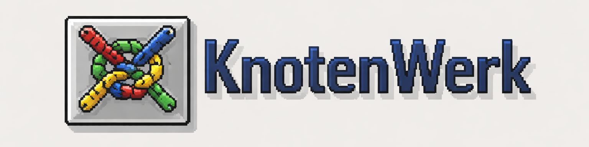
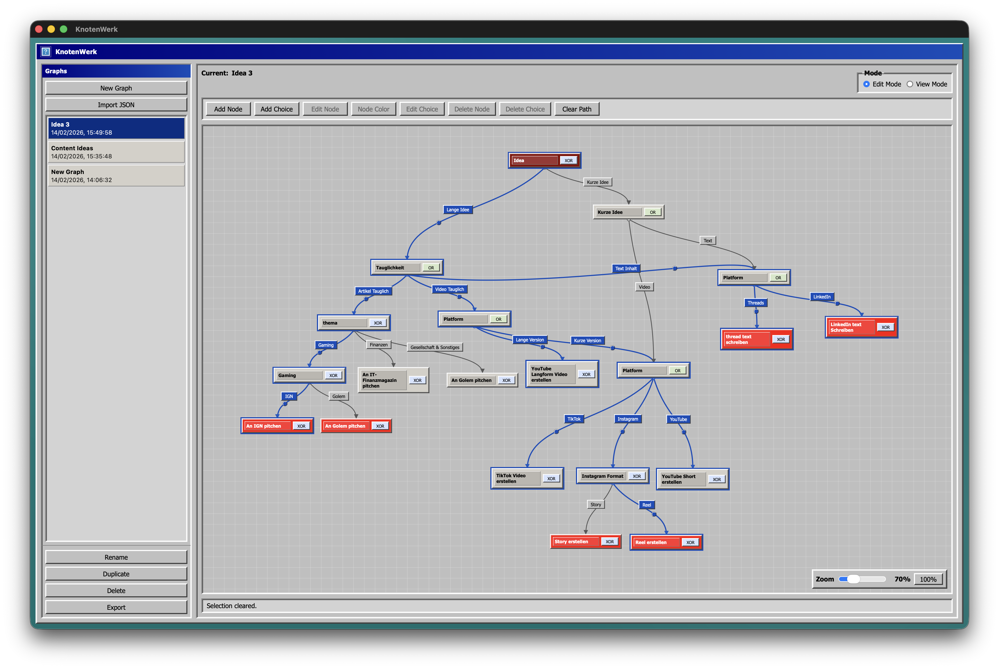

# KnotenWerk 🪢

**No-distraction. Your granddad's UI design for simple trees and graphs that help you design solutions.**

KnotenWerk is a lightweight desktop app for building and using **interactive decision trees and graph-based flows**.

No clutter. No dashboards. No noise.  
Just nodes, paths, and decisions.

---

## ✨ Features

### 🧠 Build decision trees

- Create nodes with custom text
- Add labeled choices (edges) between nodes
- Structure complex decisions visually

### 🎮 Two modes

- **Edit Mode**  
  Build and modify your graph

- **View / Demo Mode**  
  Click through decisions and follow paths interactively  
  → highlights nodes and edges in real time

### 📦 Export everything

- **JSON** → portable, editable, source of truth
- **SVG** → clean visuals for docs and presentations
- **Markdown** → shareable decision flows

### 💾 Local-first

- Your graphs are stored as JSON files
- No cloud, no accounts, no lock-in

---

## 🖥️ UI Philosophy

KnotenWerk embraces a **Windows 98-inspired interface**:

- Familiar, distraction-free layout
- No modern UI overload
- Focus on structure and clarity

If you ever used tools that felt _too smart_, this is the opposite.
